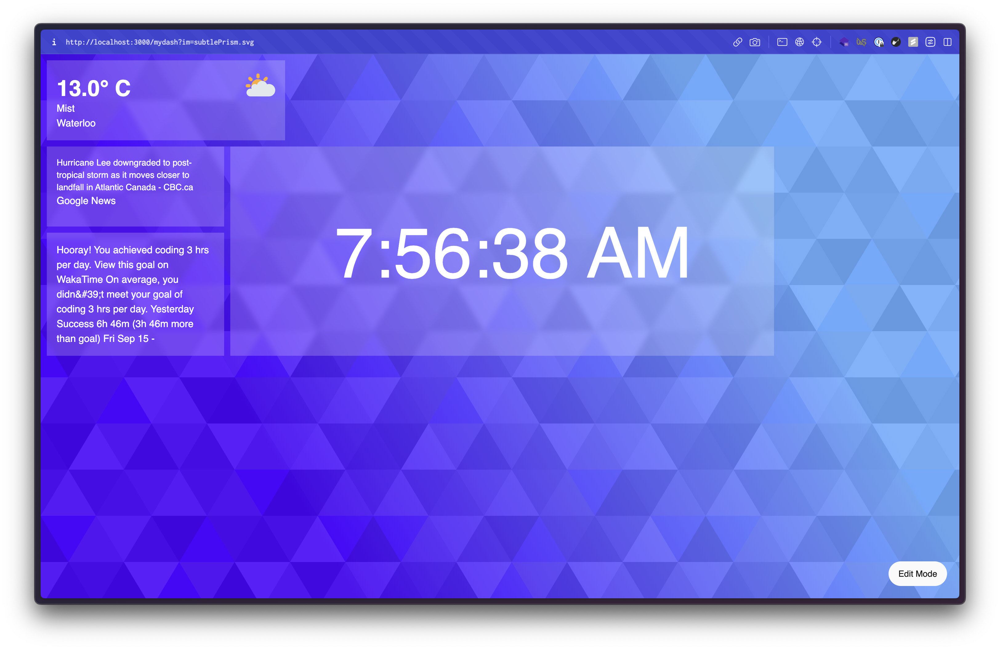

# Dash - Your Personalized Digital Dashboard

Welcome to Dash, your customizable digital dashboard designed to simplify your online life. Dash provides you with a central hub for all your frequently visited web resources, whether it's stock information, course schedules, weather updates, news summaries, or actionable emails. It's your one-stop solution to automate complexity out of your daily digital workflow.

This project was created at [Hack the North 2023](https://hackthenorth.com/) in under 36 hours. It is currently deployed live at [dashapp.tech](https://dashapp.tech). View the devpost for Dash [here](https://devpost.com/software/dash-um2zil).

## The Stack

We follow the T3 stack for this project, including:

- **Frontend:**

  - **NextJS:** A React framework for building server-rendered web applications.
  - **Typescript:** A statically typed superset of JavaScript, adding type annotations for improved code quality and maintainability.
  - **tRPC:** Likely a library or tool for handling TypeScript RPC (Remote Procedure Call) requests.
  - **Tailwind CSS:** A utility-first CSS framework for rapidly building custom user interfaces.

- **Backend:**

  - **Prisma:** An ORM (Object-Relational Mapping) used to interact with your database.
  - **Cockroach DB:** A distributed SQL database used to store user data, including authentication, layout configurations, and more.

- **External APIs:**

  - **Google Cloud:** Used for integrating Gmail, Google Calendar, and other Google services.
  - **Open Weather API:** Provides live weather data based on user location.
  - **Yahoo Finance API:** Used to retrieve the latest stock prices and information.
  - **News API:** Provides live news updates and summaries.

- **Development and Deployment:**
  - **GitHub:** Your version control system for managing the project's codebase.
  - **Vercel:** A deployment service integrated with GitHub for Continuous Integration/Continuous Deployment (CI/CD).

### Accomplishments

- [x] **Dynamic Layout:** Implemented a fully dynamic layout system that allows users to customize their dashboard layout.
- [x] **Widget Adding Tool:** Created an intuitive tool for adding widgets to the dashboard.
- [x] **Working Stock Display Widget:** Implemented a real-time stock display widget.
- [x] **Dynamic Layout Storage:** Stored dynamic layout configurations in the database, ensuring user changes are saved and synchronized.
- [x] **Gmail API Integration:** Seamlessly integrated with the Gmail API to provide email-related widgets and updates.
- [x] **News Integration:** Incorporated news APIs to deliver live news updates on the dashboard.
- [x] **Weather Integration:** Utilized weather APIs to provide users with real-time weather data based on their location.
- [x] **Calendar Integration:** Integrated with calendar APIs to display calendar events and schedules on the dashboard.
- [x] **User Authentication:** Implemented user authentication and authorization using Next-Auth and Prisma.

### Things to Add

- [ ] **Additional UI Customization Options:** Add more options for customizing information display and font styles.
- [ ] **Improved Widget Loading Efficiency:** Enhance the efficiency of loading widgets for a smoother user experience.
- [ ] **Custom Themes and Backgrounds:** Allow users to upload and apply custom themes and backgrounds to personalize their dashboards.
- [ ] **Multiple Dashboard Support:** Implement support for multiple dashboards and dynamic context-based switching for users.
